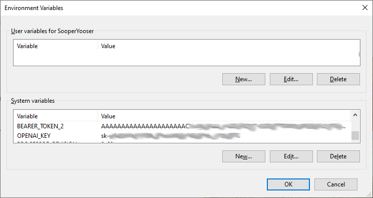
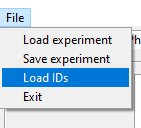

Explorer Apps
====================================
There are six working applications and three deprecated applications in this project, ~~_KeywordExplorer_~~, ~~_TweetsCountExplorer_~~, ~~_TweetDownloader_~~,  _ContextExplorer_, _NarrativeExplorer2_, _TerrainFromGML_, _WikiPageviewExplorer_, _TweetEmbedExplorer_, and _ModelExplorer_. The latest stable version can be installed with pip:

    pip install keyword-explorer

A brief overview of each can be reached using the links below.

**ContextExplorer** (Documentation in the works) Works with the OpenAI API, mostly to do experiments with context prompting on large corpora.

**NarrativeExplorer2** (Documentation in the works) Works with the OpenAI API to produce graphs of narratives generated by GPT models.

**TerrainFromGML** (Documentation in the works) Builds 3D terrain from the graphs generated by NarrativeExplorer2.

[~~**KeywordExplorer**~~](./markup/KeywordExplorer.md) Deprecated due to X/Twitter API changes. Is a Python desktop app that lets you use the GPT-3 to search for keywords and Twitter to see if those keywords are any good.

[~~**TweetCountsExplorer**~~](./markup/TweetsCountExplorer.md) Deprecated due to X/Twitter API changes. Is a Python desktop app that lets you explore the quantity of tweets containing keywords over days, weeks or months.

[~~**TweetDownloader**~~](./markup/TweetDownloader.md) Deprecated due to X/Twitter API changes. Is a Python desktop app that lets you select and download tweets containing keywords into a database. The number of Tweets can be adjusted so that they are the same for each day or proportional. Users can apply daily and overall limits for each keyword corpora.

[**WikiPageviewExplorer**](./markup/WikiPageviewExplorer.md) is a Python desktop app that lets you explore keywords that appear as articles in the Wikipedia, and chart their relative page views.

[**TweetEmbedExplorer**](./markup/TweetEmbedExplorer.md) is a Python desktop app for analyzing, filtering, and augmenting tweet information. Augmented information can them be used to create a train/test corpus for finetuning language models such as the GPT-2,

[**ModelExplorer**](./markup/ModelExplorer.md) is a Python desktop app that lets a user interact with a finetuned GPT-2 model trained using EmbeddingExplorer

## Before Using! <span id = "before-using"/>
Most of these apps **require** that you have an OpenAI account and/or a Twitter developer account:
* _ContextExplorer_ requires an OpenAI account
* _NarrativeExplorer2_ requires an OpenAI account
* _TerrainFromGML_ uses the [Panda3D](https://www.panda3d.org/) API
* ~~_KeywordExplorer_ requires a Twitter and OpenAI account~~
* ~~_TweetCountExplorer_ requires a Twitter developer account~~
* _WikiPageviewExplorer_ uses the wikipedia API (pip install wikipedia), and requires a user agent
* ~~_TweetDownloader_~~ requres additional elements such as a database, which will be descussed in its section but not here.
* _TweetEmbedExplorer_ requires a Twitter account, OpenAI account, and a MariaBD/MySQl database
* _ModelExplorer_ uses the HuggingFace _transformers_ API (pip install transformers), and a MariaDB/Mysql database
* _ModelExplorer_ requires GPT-2 models trained on corpora generated by _TweetEmbedExplorer_. To train a model, follow these steps: [How to train a model](./markup/model_train.md)

The following links are very helpful:

- OpenAI: https://openai.com/api/
- https://beta.openai.com/docs/introduction
- ~~Twitter: https://developer.twitter.com/en~~
- ~~https://developer.twitter.com/en/docs/twitter-api/getting-started/getting-access-to-the-twitter-api~~
- ~~https://developer.twitter.com/en/docs/authentication/guides/v2-authentication-mapping~~
- HuggingFace: https://huggingface.co/docs/transformers/installation

In each case you'll have to get an ID and set it as an environment variable. The names must be OPENAI_KEY for your GPT-3 account and BEARER_TOKEN_2 for your Twitter account, as shown below for a Windows environment:

>

If you don't have permissions to set up environment variables or just don't want to, you can set up a json file and load that instead:

```
{
  "BEARER_TOKEN_2": "AAAAAAAAAAAAAAAAAAAAAC-----------------------",
  "OPENAI_KEY": "sk-s------------------------------------",
  "USER_AGENT": "xyz@xyz.com",
}
```

In this case, BEARER_TOKEN_2 id for the Twitter V2 account, OPENAI_KEY is for the GPT-3, and USER_AGENT is for accessing the Wikipedia. 

To load the file click on the "File" menu and select "Load IDs". Then navigate to the json file and select it. After the ids are loaded, any application that depends on them will run. If you try using an app that doesn't have an active ID, it will complain.

>

You should be good to use the apps!
