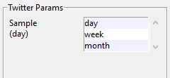

## KeywordExplorer

KewordExplorer is a Python desktop app that lets you use the GPT-3 to search for keywords and Twitter to see if those keywords are any good. Below is an example of the running app:

And this is an example of the Twitter results:

## How to use

Using the tool is pretty straightforward. That being said, it's possible to break it. If you are running it in the console, then you will get additional information on the command line that might help you figure out things. Most often, it is a poorly-formed keyword that gets sent off to Twitter. Also, setting up your twitter account properly is tricky, so make sure that you have that working for counts. See

https://developer.twitter.com/en/docs/twitter-api/tweets/counts/introduction

if you run into trouble.

The screen is divided into 5 regions:
- GPT
- GPT Params
- Twitter
- Twitter Params
- Console

### GPT

This is where you interact with the GPT-3 directly. You might want to use the GPT-3 playground a bit to get the hang of writing prompts (https://beta.openai.com/playground). The app starts up with a default prompt. You can replace that with your prompt directly, or load a saved prompt using the "File->Load Experiment" menu dropdown.

Let's look at the default prompts a little more closely:

    Here's a short list of popular pets
    1)

The extra line with the "1)" prompts the GPT to return a numbered list. Most of the time. Sometimes it will return a paragraph about how great dogs or cats are. The GPT-3 has a value called _temperature_ which adds some randomness to the prompt response. In this app, the value is fixed at 0.4 on a scale from 0.0 to 1.0.

Clicking on 'New Prompt' will send that prompt to the GPT-3. You'll see that it was sent, along with the selected engine and the number of tokens in the *Console* window. If you want to continue prompting, then 'Extend Prompt', which will add the results to the initial prompt. You may have to edit the text a bit, since the GPT can stop in mid-word while generating a response.

Clicking on 'Parse Response' will apply the regex in the 'Parse Regex' field to each line in the resonse text that is longer than _Max Chars and place the parsed results in the 'Test Keyords' area in the Twitter section (described [Twitter](#twitter-region) below). You can edit or try new regexes if you have a different form of output. I highly recommend (https://regex101.com) as a place to test out regexes on text. You can copy the text from the Response field into their playground.

Clicking on 'Extend Prompt' will use the current prompt, plus the text that has already been returned to create a new prompt. The result will be appended to the current response.

### GPT Params 

This part of the app lets you determine the number of [tokens](https://help.openai.com/en/articles/4936856-what-are-tokens-and-how-to-count-them) to let the GPT-3 use when its generating a response. Tokens cost money, so the choices are limited to values that get results but don't go overboard.

The second part of this section lets you choose the GPT-3 [model](https://beta.openai.com/docs/models/gpt-3) (or engine as it's refered to in their API). There are several choices, ranging from "davinci" (the most powerful and expensive) to "ada", (the cheapest and fastest, but not as powerful) the default is davinci, but play around and see what works for you.

### Twitter 

This panel lets you explore counts of keywords and hashtags for the period of time that you're interested in. You set your start and end dates in the date fields (Be careful with the format, the parser is brittle). You can adjust the sampling rate in the [Twitter Params] panel. 

The algorithm for getting keyword counts has two elements - the keyword, and the span of days. Twitter breaks the response into several pieces. Each piece counts as a resuest of the Twitter V2 API, and it only allows so many requests, so don't try to pull in a full year of daily Tweets for a large set of keywords. 

TODO: Add descriptions of what the buttons do

### Twitter Params 

If your request spans too much time, you can subsample across weeks or months. Unlike the "day" option, these are not complete counts. Instead they subsample a week or month (Hey [@TwitterDev](https://twitter.com/TwitterDev)! Could you add these as options?). As such they are not accurate counts, but are still good for determining realative trends between keywords.
