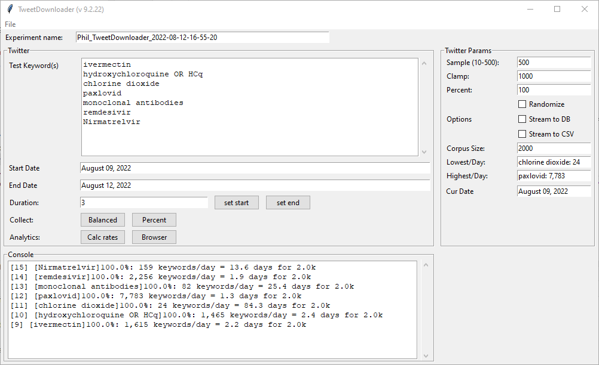
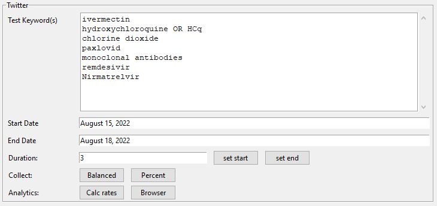
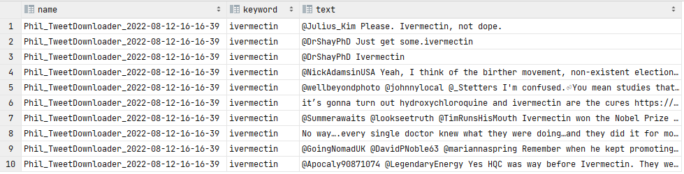
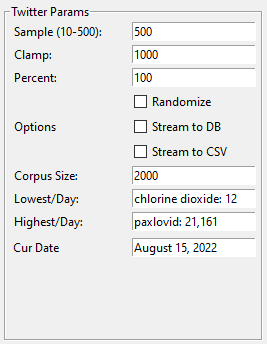
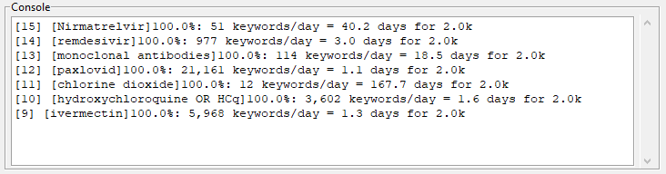

## ~~TweetDownloader~~ (Deprecated due to Twitter/X API access)

_TweetDownloader_ is a standalone Python application that manages balanced and proportional downloading of tweets based on keywords over a specified time range.



## Before Starting
The app **requires** that you have a Twitter developer account:

See Twitter for how to get an account and bearer token: https://developer.twitter.com/en

See the [**Before Using** in the README](../README.md) for how to set up the app to access the Twitter bearer token.  _TweetDownloader_ requres additional a MySQL-compatable database. My favorite is MariaDB, wich comes with the [XAMPP stack](https://www.apachefriends.org/). The code uses the LOCAL_ROOT_MYSQL system variable, which you can set up in Windows by using the [Environment Variables](https://docs.oracle.com/en/database/oracle/machine-learning/oml4r/1.5.1/oread/creating-and-modifying-environment-variables-on-windows.html) control panel as shown below:


The schema for the database is in the **data** directory. The database must be named **twitter_v2**. The easiest way that I know to create the database is to open a console window in the directory with the sql file, then access the database (e.g. <span style="font-family:Courier;">mysql -u root -pmy_sql_password123</span>). At the sql prompt, type the following

```
MariaDB [(none)]> create database twitter_v2;
MariaDB [(none)]> use twitter_v2;
MariaDB [twitter_v2]> source twitter_v2_schema.sql;
MariaDB [twitter_v2]> describe twitter_v2;
+-----------------------------------+
| Tables_in_twitter_v2              |
+-----------------------------------+
| keyword_tweet_view                |
| table_experiment                  |
| table_query                       |
| table_tweet                       |
| table_user                        |
| tweet_user_cluster_view           |
+-----------------------------------+
6 rows in set (0.001 sec)
```

At this point the app should be ready to use.

## How to use

Using the tool is pretty straightforward. That being said, it's possible to break it. If you are running it in the console, then you will get additional information on the command line that might help you figure out things. Most often, it is a poorly-formed keyword that gets sent off to Twitter. Also, setting up your twitter account properly is tricky, so make sure that you have that working for counts. See the following:

- https://developer.twitter.com/en/docs/twitter-api/getting-started/getting-access-to-the-twitter-api
- https://developer.twitter.com/en/docs/authentication/guides/v2-authentication-mapping

if you run into trouble.

The screen is divided into 4 panels:
- Experiment name - see description in [KeywordExplorer](../markup/KeywordExplorer.md)
- [Twitter](#twitter-panel)
- [Twitter Params](#twitter-params-panel)
- [Console](#console)

### Twitter <span id="twitter-region"/>


This panel is for organizing the retrieval of tweets containing keywords as separate entries in the database. For example, the query:

```select name, keyword, text from keyword_tweet_view limit 10;```

returns the following in my dataset:

> 

The controls and their functions are described below:

#### Test Keywords
This area contains the keywords and hashtags that you wish to download. Each line represents a sigle term (like "chlorine dioxide"), but you can connect multiple terms by using "OR" (e.g. "hydroxychloroquine PR HCq"), which will return both terms. 
#### Start Date
Sets the start date for a pull
#### End Date
Sets the last possible date for a pull. If the corpora size is reached before the last day, then the pull will stop early
#### Duration
The number of days for a query to iterate over. Clicking the **set start** will set the start date to be the end date minus the duration. Likewise, clicking the **set end** will set the end date to be the start date plus the duration.
#### Collect
Launches the set of request to Twitter to pull down tweets and store them in the database. Clicking **Balanced** will cause the number of tweets doanloaded for each keyword to be approximately equal to the smallest number of keywords for that day. Clicking **Percent** will download the same percentage of tweets for each keyword.
#### Analytics
Clicking the **Calc Rates** button will calculate the number of tweets for each keyword on **Start Date**. Based on this it will estimate the number of days needed to reach the corpora size desired. The results are printed to the [console](#console). You can see an example at the bottom of this document. The highest and lowest values are copied to the **Lowest/Day** and **Highest/Day** fields in the [Twitter Params](#twitter-params-region).

Clicking **Browser** will launch the default browser with a tab for each keyword during the time period specified by **Start Date** and **End Date**

### Twitter Params <span id="twitter-params-region"/>
>

This panel adjusts the parameters that control how many tweets are doawnloaded per day and overall.

#### Sample (10-500)
Twitter has a range of tweets that it will download in one pull, that ranges between 10-500. Pulls that are greater than this value are broken down into multiple requests. _TweetDownloader_ samples across a day using requests of size **Sample**. Smaller samples mean more requests, but also more samples across the day.
#### Clamp
The maximum number of tweets that will be pulled per day in the date range
#### Percent
The percentage of all tweets per day for a keyword to be sampled. If there are 1,000 tweets on the day being sampled, and **Percent** is set to 10, then 100 tweets will be pulled. If **Sample** is set to 10, then there will be 10 pulls of 10 tweets each.
#### Options
Currently disabled. 
#### Corpus Size
The maximum number of tweets to download per keyword. If this is reached before the **End Date**, the query will stop
#### Lowest/Day
Generated when **Calc rates** is clicked in the [Twitter](#twitter-region) is clicked. It will show the keyword with the fewest number of tweets for the **Start Date**. In the screenshot, the keyword is "chlorine dioxide", and the number of tweets is 12.
#### Highest/Day
Generated when **Calc rates** is clicked in the [Twitter](#twitter-region) panel. It will show the keyword with the largest number of tweets for the **Start Date**. In the screenshot, the keyword is "paxlovid", and the number of tweets is 21,161.
#### Cur Date
The date that is being queried as the request is running

### Console <span id="console"/>
>

The console window is where much of the logging output of the app goes. If you launch the app from the command line, more information will be available there.

The newest output is inserted at the top of the list. The console is only for output. Typing text here has no effect. In this example, the console is showing the results of **Calc rates**, clicked in the [Twitter](#twitter-region) panel. For each keyword, the selected percentage (100% in this case), the number of keywords per day, and the number of days needed to reach the corpus size are all shown.
