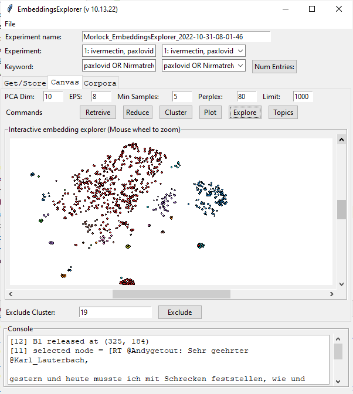
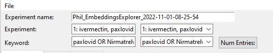
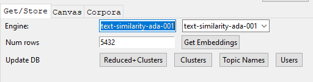
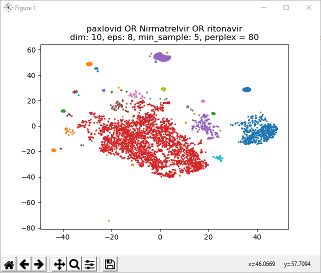
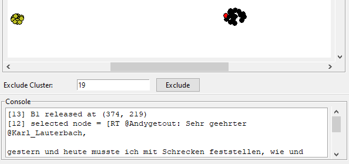
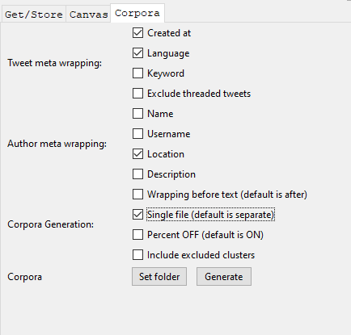

## TweetEmbedExplorer (Still works, but only with archived data)

_TweetEmbedExplorer_ is a standalone Python application for analyzing, filtering, and augmenting tweet information. Augmented information can them be used to create a train/test corpus for finetuning language models such as the GPT-2.



## Before Starting
The app **requires** that you have a Twitter developer account and an OpenAI GPT-3 account:

See Twitter for how to get an account and bearer token: https://developer.twitter.com/en

See OpenAI for how to get an account: https://openai.com/api/

See the [**Before Using** in the README](../README.md) for how to set up the app to access the Twitter bearer token and use you OpenAI identifier.  

_TweetEmbedExplorer_ requres additional a MySQL-compatable database. My favorite is MariaDB, wich comes with the [XAMPP stack](https://www.apachefriends.org/). The code uses the LOCAL_ROOT_MYSQL system variable, which you can set up in Windows by using the [Environment Variables](https://docs.oracle.com/en/database/oracle/machine-learning/oml4r/1.5.1/oread/creating-and-modifying-environment-variables-on-windows.html) control panel as shown below:


The schema for the database is in the **data** directory. The database must be named **twitter_v2**. The easiest way that I know to create the database is to open a console window in the directory with the sql file, then access the database (e.g. <span style="font-family:Courier;">mysql -u root -pmy_sql_password123</span>). At the sql prompt, type the following

```
MariaDB [(none)]> create database twitter_v2;
MariaDB [(none)]> use twitter_v2;
MariaDB [twitter_v2]> source twitter_v2.sql;
MariaDB [twitter_v2]> describe twitter_v2;
+-----------------------------------+
| Tables_in_twitter_v2              |
+-----------------------------------+
| keyword_tweet_view                |
| table_experiment                  |
| table_query                       |
| table_tweet                       |
| table_user                        |
| tweet_user_cluster_view           |
+-----------------------------------+
6 rows in set (0.001 sec)
```

At this point the app should be ready to use.

## How to use

Using the tool is pretty straightforward. That being said, it's possible to break it. If you are running it in the console, then you will get additional information on the command line that might help you figure out things. Also, setting up your twitter account properly is tricky, so make sure that you have that and your OpenAi accounts working first.

There are three tabs, _Get/Store_, _Canvas_, and _Corpora_. All of these share a common interface at the top of the App that lets you set the experiment name (for spreadsheet file names), and then load the part of the database you're interested in. Note that the database is populated initially by [TweetDownloader](TweetDownloader.md). As with all the Apps in this suite, there are extensive tooltips to help you with using the tool.


<br/>Figure 1: _Common Elements_

### Get/Store Tab

This tab handles the generation and storing of text embeddings. The app uses GPT-3 embeddings as the basis. The size of the embedding vector is based on the engine selected (see more [here](https://beta.openai.com/docs/guides/embeddings)). Clicking the **Get Embeddings** will iterate through the selected items in the database and add the GPT embeddings to them. It's surprisingly quick, though be patient. Num rows shows the number of tweets that were updated

The _Update DB_ row handles additional items that can be added to the database. The **Reduced+Clusters** and **Clusters** store data that is generated in the _Canvas_ tab. The **Topic Names** button is currently nonfunctional, but will use the GPT-3 to come up with human-readable cluster names. The **Users** button causes the user associated with each tweet to be downloaded from Twitter. This is important for getting location, since tweets rarely have that information associated with them.
<br/>
<br/>


### Canvas Tab

The _Canvas_ tab is the most complex, with a lot of capability. The first row contains the parameters used for calculating the dimension reduction from the GPT-3 vectors to a 2D display. This is done by clicing the **Reduce** button. It has two passes - the first pass is a [Principal Components Analysis](https://scikit-learn.org/stable/modules/generated/sklearn.decomposition.PCA.html) that reduces the GPT vectors to a smaller value that can be processed into 2 dimensions using [T-SNE](https://scikit-learn.org/stable/modules/generated/sklearn.manifold.TSNE.html). The parameter that affects behavior the most is [perplexity](https://scikit-learn.org/stable/auto_examples/manifold/plot_t_sne_perplexity.html?highlight=perplexity), which can be adjusted using the **Perplex:** field.

Once the 2D mapping is generated, then the embedding can be displayed using the **Plot** button. This brings up a [matplotlib scatter plot](https://matplotlib.org/stable/api/_as_gen/matplotlib.pyplot.scatter.html) that allows for a quick evaluation of the current state of the embeddings.

Once the embedding looks satisfactory, it can be clustered using [DBSCAN](https://scikit-learn.org/stable/modules/generated/sklearn.cluster.DBSCAN.html)  by clicking on the **Cluster** button. Clustering depends on two values, [**EPS**](https://stats.stackexchange.com/questions/225655/what-is-the-interpretation-of-eps-parameter-in-dbscan-clustering) which specifies how close points should be to each other to be considered a part of a cluster. If thedistance between two points is lower or equal to the EPS, then the points are considered neighbors. The other value is **Min Samples**, which is the number of close points needed to be considered a cluster. The minimum value is three. Adjusting these values and re-rendering with **Plot** can allow you to quickly determine good clustering values (see below)



The **Explore**  button brings up an interactive space to explore the embedding. It is _much_ slower than PyPlot, because you can click on the points and see what the tweets are and what cluster they belong to. By using the **Limit** field, a sampling of the points will be used. The default of 1,000 is often enough to provide a useful interface. 

The **Exclude Cluster** field and button allow you to explore individual nodes. In the figure below, you can see that a tweet in cluster 19 has been clicked. Three things happen when a node is clicked. It turns red, the text of the tweet is shown in the Console, and the cluster id is shown in the text field. If the **Exclude** button is pressed, that cluster ID will be added to a table of excluded clusters. The entire cluster then turns black to indicate that it is marked as excluded. Then generating a training corpus, these flagged clusters can be _excluded_ from the training set.
<br/>
<br/>


Lastly, the **Retrieve** button can pull all previous embedding information from the database for new analysis or corpora generation. This lets you revisit your data and adjust over multiple sessions


### Corpora Tab



Once a model test train corpora has been created, you can finetune a GPT model to generate new tweets that are similar to the training set. A trained model has been shown to be able to accurately predict, for example, the vegetarian preferences of Yelp reviewers when all vegetarian data has been excluded from the test/train data (https://arxiv.org/abs/2204.07483). This means that you can train a model on a set of tweets that may not contain the explicit information you are looking for (e.g. how a target group might react to a new product) and the model will still be able to generate tweets that are likely to contain that information.

To train a model, follow these directions: [How to train a model](../markup/model_train.md).

The checkboxes allow the corpora to configured in particular ways. There are three groups:

#### Tweet meta wrapping
These checkboxes generally add a string segment to a line of corpora test/train text:

* _Created At_ - Adds a "|| created: YYYY-MM-DD HH:MM"SS ||"
* _Language_ - Adds a "|| language: xx ||"
* _Keyword_ - Adds a ""|| keyword: xx ||" that shows the keyword used for the pull
* _Exclude threaded tweets_ - Checking this cause any tweets that were downloaded as threads but **do not** contain the keyword to be ommitted from the training corpora

#### Author meta wrapping
These checkboxes all add a string segment to a line of corpora test/train text. For these elements to work, the author information must be downloaded seperately by clicking the **User** button in the **Get/Store** tab:

* _Name_ - The name of the author as written in their profile
* _Username_ - the screen name of the author
* _Location_ - the author's location as written in their profile
* _Description_ - The author's self description as written in their profile

#### Corpora Generation
These options let the user select how the corpora files will be generated.

* _Wrapping before text_ - By default, meta information is written _after_ the tweet. This means that the model is trained so that the content of the tweet influences the meta information. Checking this box means that the meta information will preceed the tweet, so explorations of location, for example , on the content of tweets can be done
* _Single File_ - This causes all the tweets to be combined into a single test and single train file. This provides more text to train the model, but means that the a model would be, for example, trained on tweets with the keywords "kittens" **and** "puppies", rather than a kitten model and a puppy model.
* _Percent OFF_ - By default, each line in the corpora contains a meta wrapping substring of the form "|| probability: xxxx]]", where xxxx can be "ten", "twenty", "thirty", or "forty". The likelihood that a line will have the appropriate string reflects the probability of the random number generator hitting that value. This provides a quick check of the fidelity of the model, which should generate these values in the same percentages if trained correctly.
* _Include excluded clusters_ - If checked, then all tweets containing the specified keyword will be included. If not then tweets belonging to excluded clusters will not be included in the corpora.


Lastly, there are two _Corpora_ buttons below the checkboxes. The first (_Set folder_) sets the location that all files will be written to. The second (_Generate_) causes the files to be written. If _all_keywords_ option has been selected from [Common Elements](#how-to-use), then a test file and a train file for each of the keywords in an experiment will be generated, so choose your file location to minimize confusion. 

At this point, you can train your model(s) using the Huggingface Transformers library as described [**here**](../markup/model_train.md).


