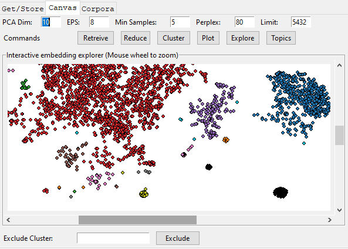

# TweetEmbedExplorer

_TweetEmbedExplorer_ is a standalone Python application for analyzing, filtering, and augmenting tweet information. Augmented information can them be used to create a train/test corpus for finetuning language models such as the GPT-2.


## Before Starting
The app **requires** that you have a Twitter developer account and an OpenAI GPT-3 account:

See Twitter for how to get an account and bearer token: https://developer.twitter.com/en

See OpenAI for how to get an account: https://openai.com/api/

See the [**Before Using** in the README](../README.md) for how to set up the app to access the Twitter bearer token and use you OpenAI identifier.  

_TweetEmbedExplorer_ requres additional a MySQL-compatable database. My favorite is MariaDB, wich comes with the [XAMPP stack](https://www.apachefriends.org/). The code uses the LOCAL_ROOT_MYSQL system variable, which you can set up in Windows by using the [Environment Variables](https://docs.oracle.com/en/database/oracle/machine-learning/oml4r/1.5.1/oread/creating-and-modifying-environment-variables-on-windows.html) control panel as shown below:


The schema for the database is in the **data** directory. The database must be named **twitter_v2**. The easiest way that I know to create the database is to open a console window in the directory with the sql file, then access the database (e.g. <span style="font-family:Courier;">mysql -u root -pmy_sql_password123</span>). At the sql prompt, type the following

```
MariaDB [(none)]> create database twitter_v2;
MariaDB [(none)]> use twitter_v2;
MariaDB [twitter_v2]> source twitter_v2.sql;
MariaDB [twitter_v2]> describe twitter_v2;
+-----------------------------------+
| Tables_in_twitter_v2              |
+-----------------------------------+
| keyword_tweet_view                |
| table_experiment                  |
| table_query                       |
| table_tweet                       |
| table_user                        |
| tweet_user_cluster_view           |
+-----------------------------------+
6 rows in set (0.001 sec)
```

At this point the app should be ready to use.

## How to use

Using the tool is pretty straightforward. That being said, it's possible to break it. If you are running it in the console, then you will get additional information on the command line that might help you figure out things. Also, setting up your twitter account properly is tricky, so make sure that you have that and your OpenAi accounts working first.





