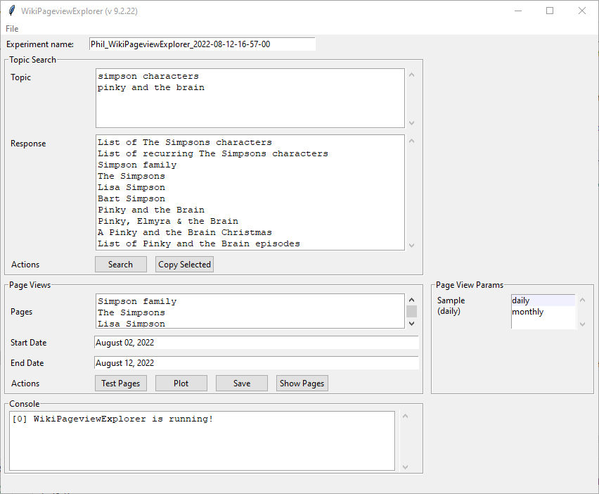
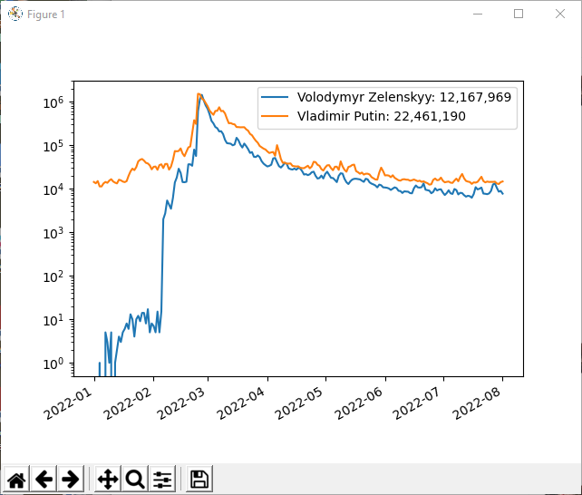
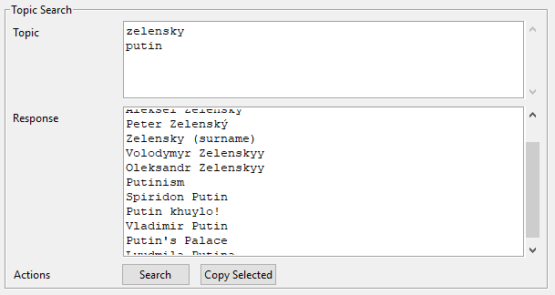
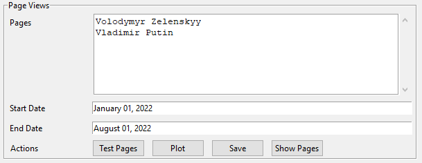
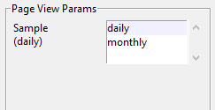
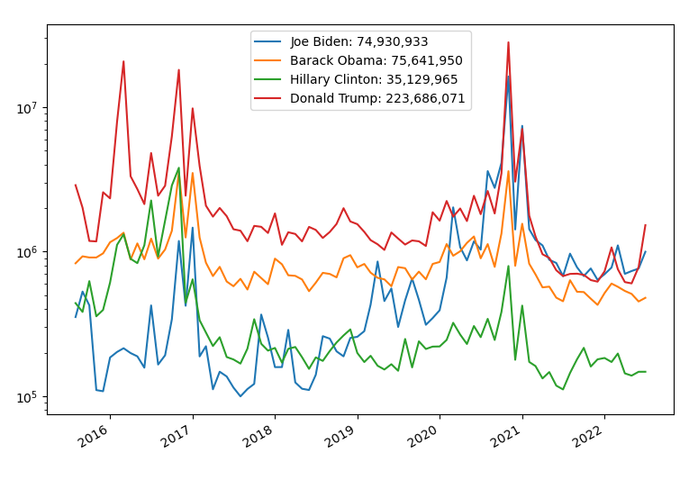

# WikiPageviewExplorer

Don't have a Twitter or OpenAI account? Not to worry! _WikiPageviewExplorer_ is a Python desktop app that lets you interactively search for (English) entries using keywords. Pages that contain or relate to the keywords are presented in a list that can then be queried for the number of daily pageviews within a date range.

>

And this is an example of the page views:

>

Best of all, the Wikipedia is free, and their API is _fast_. You can do a lot of keywords research here too. And show your love for the Wikimedia foundation by [donating](https://donate.wikimedia.org/wiki/Ways_to_Give) so that this app continues to work!

## How to use

Using the tool is pretty straightforward. That being said, it's possible to break it. If you are running it from the command line, then you will get additional information in the console that might help you figure out things. Most often, it is a poorly-formed keyword that gets sent off to the Wikipedia.

The screen is divided into 5 panels:
- Experiment name - see description in [KeywordExplorer](../markup/KeywordExplorer.md)
- [Topic Search](#topic-search-panel)
- [Page Views](#page-views-panel)
- [Page View Params](#page-view-params-panel)
- Console - see description in [KeywordExplorer](../markup/KeywordExplorer.md)

## Topic Search 
>

The topic search panel takes keywords that are typed (or loaded using **File->Load Experiments**)). When the user clicks the **Search** button, a request is sent that looks for Wikipedia entries that are exact or approximate matches. In this example, we have two somewhat vague keywords: "zelensky" and "putin". The Wikipedia returns multiple matches, ranging from [Igor Zelensky](https://en.wikipedia.org/wiki/Igor_Zelensky), the Russian ballet dancer, to [Lyudmila Putina](https://en.wikipedia.org/wiki/Lyudmila_Putina), the former wife of Vladimir Putin.  

Selecting the [Volodymyr Zelenskyy](https://en.wikipedia.org/wiki/Volodymyr_Zelenskyy) and [Vladimir Putin](https://en.wikipedia.org/wiki/Vladimir_Putin) entries and clicking the **Copy Selected** button will copy the entry to the **Pages** text area in the [Page Views](page-views-panel) panel for exploring page views.

## Page Views 
>

This panel manages the query and display of page views within the Wikipedia. Much like [TweetCountExplorer](../markup/TweetsCountExplorer.md), you use a list of keywords, or in this case validated Wikipedia pages, and a range of dates to test. If you enter a term that is not in the Wikepedia (e.g. "zelensky"), then there will be no results for the query. Also, the queries only seem to work as far back as 2015, so be advised.

Queries are launched by clicking **Test Pages**. This will produce a diagram like the one above. If the plot is closed, it can be shown again without running another query by clicking **Plot**. Clicking **Save** will open a dialog for saving the data in an Excel spreadsheet. Clicking **Show Pages** will open each wikipedia page in the **Pages** list as seperate tabs in your system's default browser. Lastly, **Clear** will delete the entries from the **Pages** list.

## Page View Params 
>

Because the Wikipedia API is very fast, there is rarely a need to do queries for months. That being said, sometimes it is useful to look at events with a coarser view. For example, below is a chart of the page views for the US presidential candidates since 2015:

>

Both daily and monthly queries can be run with the same pages, and the resulting charts evaluated and/or saved.