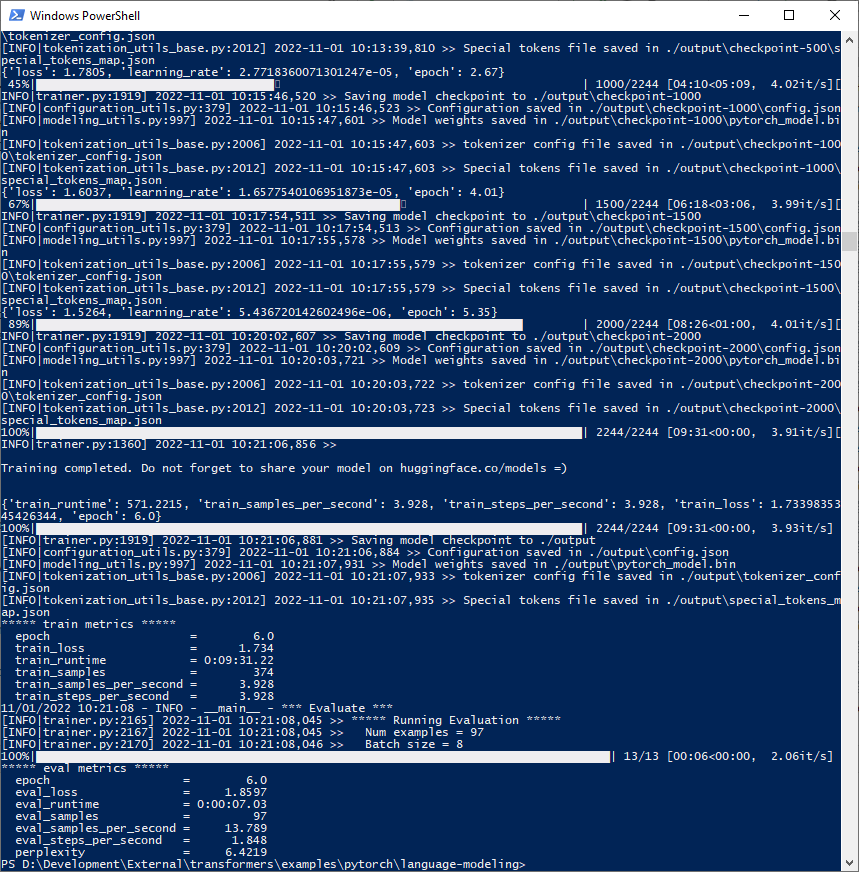
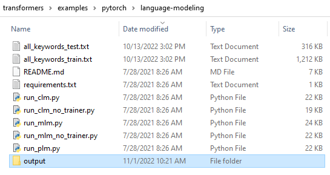
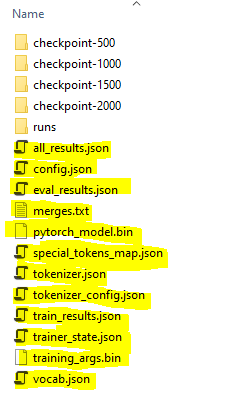
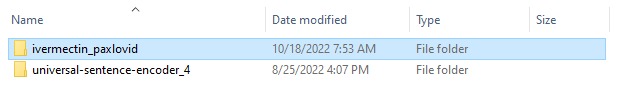

# How to Train a Huggingface GPT-2 Model
To train a model, check out the Huggingface transformers project from GitHub (https://github.com/huggingface/transformers.git). The script you want to execute to train using your corpora is _transformers/examples/pytorch/language-modeling/run_clm,py_

To run the script, you will need your text and train files (below named _all_keywords_train.txt_ and _all_keywords_test.txt_) in the directory with the script and test/train files:

        python .\run_clm.py --model_type=gpt2 --model_name_or_path gpt2 --train_file ./all_keywords_train.txt --validation_file ./all_keywords_test.txt --do_train --do_eval --output_dir ./output --per_device_train_batch_size=1 --block_size 1024 --num_train_epochs 6

Running the script will look something like this:

And it will produce an _output_ folder that will contain the model and the checkpoints:

Inside the output folder, you'll find the files that make up the trained model (highlighted in yellow).

Copy these files to a folder in your project. You will need to select this folder to run the model from within the ModelExplorer App.

At this point you should be ready to go!